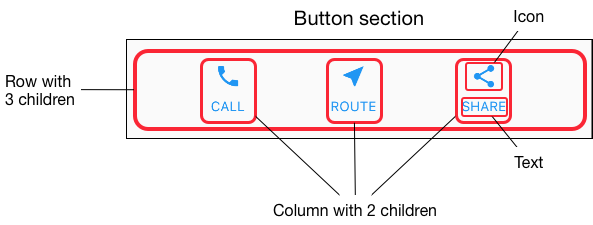

# Flutter Layout

<b>App-> flutter_layouts </b>

The core of Flutter’s layout mechanism is widgets. In Flutter, almost everything is a widget—even layout models are widgets.  [Container](https://api.flutter.dev/flutter/widgets/Container-class.html) is a widget class that allows you to customize its child widget. Use a `Container` when you want to add padding, margins, borders, or background color, to name some of its capabilities.


## Initial Boilerplate

```dart
import 'package:flutter/material.dart';

void main() {
  runApp(MyApp());
}

class MyApp extends StatelessWidget {
  // This widget is the root of your application.
  @override
  Widget build(BuildContext context) {
    return MaterialApp(
      title: 'Flutter layouts',
      home: Scaffold(
        appBar: AppBar(
          title: Text('Futter Layouts Demo'),
        ),
        body : Center(
          child: Text('Flutter Layouts'),
        )
      ),
    );
  }
}
```

## Layout Diagram

 In this example, four elements are arranged into a column: an image, two rows, and a block of text.


Next, diagram each row. The first row, called the Title section, has 3 children: a column of text, a star icon, and a number. Its first child, the column, contains 2 lines of text. That first column takes a lot of space, so it must be wrapped in an `Expanded widget`.


The second row, called the Button section, also has 3 children: each child is a column that contains an icon and text.



## Title Bar (ROW)

Create the layout like this:

```dart
Widget titleSection = Container (
  padding: EdgeInsets.all(32),
  child: Row (
    children: [
      Expanded(  //the first child inside the row  -> contains 2 rows of texts
        child: Column(
          crossAxisAlignment: CrossAxisAlignment.start,
          children: [
            Container(
              padding: const EdgeInsets.only(bottom: 8),
              child: Text(
                'Oeschinen Lake Campground',
                 style: TextStyle(fontWeight: FontWeight.bold)) //The Heading,
            ),
            Text(  //the subtext
              'Kandersteg, Switzerland',
              style: TextStyle(color: Colors.grey[500]),
            ),
          ],
        ),
      ),
      Icon(
        Icons.star,
        color: Colors.red[500],
      ),
      Text('41')
    ],
  ),
);
```

and then use this inside the app by changing the body:

```dart
body : Column (
          children: [
            titleSection
          ],
        )
```

Note:

- Putting a Column inside an Expanded widget stretches the column to use all remaining free space in the row. Setting the `crossAxisAlignment` property to `CrossAxisAlignment.start` positions the column at the start of the row.
- Putting the first row of text inside a Container enables you to add padding. 

## Button Row

The button section contains 3 columns that use the same layout—an icon over a row of text. The columns in this row are evenly spaced, and the text and icons are painted with the primary color.

Since the code for building each column is almost identical, create a private helper method named `buildButtonColumn()`, which takes a color, an Icon and Text, and returns a column with its widgets painted in the given color.

```dart
Column _buildButtonColumn(Color color, IconData icon, String label){
    return Column(
        mainAxisSize: MainAxisSize.min,
        mainAxisAlignment: MainAxisAlignment.center,
        children: [
          Icon(icon, color: color,),
          Container(
              child: Text(
                  label,
                  style: TextStyle(
                    fontSize: 12,
                    fontWeight: FontWeight.w400,
                    color: color,
                  )
              )
          )
        ]
    );
  }
```

Inside the build method add the following:

```dart
Color color = Theme.of(context).primaryColor;
Widget buttonSection = Container (
  child: Row(
    mainAxisAlignment: MainAxisAlignment.spaceEvenly,
    children: [
      _buildButtonColumn(color, Icons.call, 'CALL'),
      _buildButtonColumn(color, Icons.near_me, 'ROUTE'),
      _buildButtonColumn(color, Icons.share, 'SHARE')
    ],
  )
);

```

Then add the buttonSection into the main app body:

```
body : Column (
          children: [
            titleSection,
            buttonSection,   //add this
          ],
        )
```

## Text Section

Define the text section as a variable. Put the text in a Container and add padding along each edge. By setting `softwrap` to true, text lines will fill the column width before wrapping at a word boundary.

```dart
Widget textSection = Container (
      padding: EdgeInsets.all(32),
      child: Text(
        'Lake Oeschinen lies at the foot of the Blüemlisalp in the Bernese '
            'Alps. Situated 1,578 meters above sea level, it is one of the '
            'larger Alpine Lakes. A gondola ride from Kandersteg, followed by a '
            'half-hour walk through pastures and pine forest, leads you to the '
            'lake, which warms to 20 degrees Celsius in the summer. Activities '
            'enjoyed here include rowing, and riding the summer toboggan run.',
        softWrap: true,
      )
    );
```

then add this section into the app body:

```dart
body : Column (
  children: [
    titleSection,
    buttonSection,
    textSection
  ],
)
```

## Image Section

- Create an `images` directory at the top of the project.
- Add [`lake.jpg`](https://raw.githubusercontent.com/flutter/website/master/examples/layout/lakes/step5/images/lake.jpg).

`BoxFit.cover` tells the framework that the image should be as small as possible but cover its entire render box.

```dart
 Image imageSection = Image.asset(
      'images/lake.jpg',
      width: 600,
      height: 240,
      fit: BoxFit.cover,
    );
```

add the section to the body:

```dart
body : Column (
          children: [
            imageSection,
            titleSection,
            buttonSection,
            textSection
          ],
        )
```

Update the `pubspec.yaml` file to include an `assets` tag. This makes the image available to your code.

```yaml
flutter:
	uses-material-design: true            
	assets:            
		- images/lake.jpg            
```

## Final Touch

In this final step, arrange all of the elements in a `ListView`, rather than a `Column`, because a `ListView` supports app body scrolling when the app is run on a small device.

```dart
body : ListView (   //listview in place of column
          children: [
            imageSection,
            titleSection,
            buttonSection,
            textSection
          ],
        )
```

