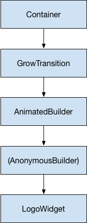

# Animation in Flutter

`Animation` is a core class in flutter animation library. An `Animation` object knows the current state of an animation but doesn’t know anything about the animation appearing on the screen.

An `AnimationController` manages the animation.

We will be using `Listeners` and `StatusListeners` to monitor animation state changes.

Widgets can either incorporate these animations in their build function directly or they can use the animations as the basis of more elaborate animations that they pass along the other widgets.

`Animation` is an abstract class. its implemented class’s objects generates values between two values over a certain duration. This object has a state which at any given point of time can be accessed using the `.value` member.

## CurvedAnimation

```dart
animation = CurvedAnimation(parent: controller, curve: Curves.easeIn);
```

The `CurvedAnimation` wraps the object it’s modifying—you don’t subclass `AnimationController` to implement a curve.

## AnimationController

[`AnimationController`](https://api.flutter.dev/flutter/animation/AnimationController-class.html) is a special `Animation` object that generates a new value whenever the hardware is ready for a new frame. By default, an `AnimationController` linearly produces the numbers from 0.0 to 1.0 during a given duration.

```dart
controller = AnimationController(duration: const Duration(seconds: 2), vsync: this);
```

After each number is generated, each `Animation` object calls the attached `Listener` objects. When creating an `AnimationController`, you pass it a `vsync` argument. The presence of `vsync` prevents offscreen animations from consuming unnecessary resources. You can use your stateful object as the vsync by adding `SingleTickerProviderStateMixin` to the class definition.

A `CurvedAnimation` can also exceed the 0.0 to 1.0 range, even if the `AnimationController` doesn’t. Depending on the curve selected, the output of the `CurvedAnimation` can have a wider range than the input.

## Tween

 If you need a different range or a different data type, you can use a [`Tween`](https://api.flutter.dev/flutter/animation/Tween-class.html) to configure an animation to interpolate to a different range or data type.

```dart
tween = Tween<double>(begin: -200, end: 0);
```

A `Tween` is a stateless object that takes only `begin` and `end`. The sole job of a `Tween` is to define a mapping from an input range to an output range.

A `Tween` object does not store any state. Instead, it provides the `evaluate(Animation animation)` method that applies the mapping function to the current value of the animation.

To use a `Tween` object, call `animate()` on the `Tween`, passing in the controller object.

```dart
AnimationController controller = AnimationController(duration: const Duration(milliseconds: 500), vsync: this);
Animation curve = CurvedAnimation(parent: controller, curve: Curves.easeOut);
Animation<int> alpha = IntTween(begin: 0, end: 255).animate(curve);
```

<b>Note: `AnimationController` derives from `Animation`, so it can be used wherever an `Animation` object is needed. However, the `AnimationController` has additional methods to control the animation.</b>


## Animation Example 1

No animation example. It just shows the flutter logo.

```dart
class LogoAnimation extends StatefulWidget {
  State<LogoAnimation> createState() => _LogoAnimationState();
}

class _LogoAnimationState extends State<LogoAnimation> {
  @override
  Widget build(BuildContext context) {
    return Center(
      child: Container(
        margin: EdgeInsets.symmetric(vertical: 10),
        height: 300,
        width: 300,
        child: FlutterLogo(),
      ),
    );
  }
}
```


## Basic Animation

Make sure to dispose of the controller when the `State` object is discarded to prevent memory leaks.

Here we are changing the logo’s height and width from 0 to 300 using animation. The `addListener()` method will be called every time the animation generates a new number and it will then call `setState()` so that the new object is rendered.

Here tween will map the animation value to that of the range[0,300].

```dart
import 'package:flutter/animation.dart';
import 'package:flutter/material.dart';

void main() => runApp(LogoApp());

class LogoApp extends StatefulWidget {
  @override
  State<LogoApp> createState() => _LogoAppState();
}

class _LogoAppState extends State<LogoApp> with SingleTickerProviderStateMixin {
  Animation<double> animation;
  AnimationController controller;

  @override
  void initState() {
    super.initState();
    controller =
        AnimationController(duration: const Duration(seconds: 2), vsync: this);
    animation = Tween<double>(begin: 0, end: 300).animate(controller)
      ..addListener(() {
        setState(() {}); //set state is called as height and width changes
      });
    controller.forward();
  }

  @override
  Widget build(BuildContext context) {
    return Center(
      child: Container(
        margin: EdgeInsets.symmetric(vertical: 10),
        height: animation.value,
        width: animation.value,
        child: FlutterLogo(),
      ),
    );
  }

  @override
  void dispose() {
    controller.dispose();
    super.dispose();
  }
}
```


## Using AnimatedWidget

The `AnimatedWidget` base class allows you to separate out the core widget code from the animation code. `AnimatedWidget` doesn’t need to maintain a `State` object to hold the animation. 

The `LogoApp` still manages the `AnimationController` and the `Tween`, and it passes the `Animation` object to `AnimatedLogo`.

```dart
import 'package:flutter/animation.dart';
import 'package:flutter/material.dart';

void main() => runApp(LogoApp());

class AnimatedLogo extends AnimatedWidget {
  AnimatedLogo({Key key, Animation<double> animation})
      : super(key: key, listenable: animation);

  Widget build(BuildContext context) {
    final animation = listenable as Animation<double>;
    return Center(
      child: Container(
        margin: EdgeInsets.symmetric(vertical: 10),
        height: animation.value,
        width: animation.value,
        child: FlutterLogo(),
      ),
    );
  }
}

class LogoApp extends StatefulWidget {
  @override
  State<LogoApp> createState() => _LogoAppState();
}

class _LogoAppState extends State<LogoApp> with SingleTickerProviderStateMixin {
  Animation<double> animation;
  AnimationController controller;

  @override
  void initState() {
    super.initState();
    controller =
        AnimationController(duration: const Duration(seconds: 2), vsync: this);
    animation = Tween<double>(begin: 0, end: 300).animate(controller);
    assert(animation != null);
    controller.forward();
  }

  @override
  Widget build(BuildContext context) => AnimatedLogo(animation: animation);

  @override
  void dispose() {
    controller.dispose();
    super.dispose();
  }
}
```


## Monitoring Animation progress

we can use `addStatusListener()` for notifications of changes to the animation’s state, such as starting, stopping, or reversing direction. Here we will monitor the state and try to run the animation in loop based on the state.

```dart
import 'package:flutter/animation.dart';
import 'package:flutter/material.dart';

void main() => runApp(LogoApp());

class AnimatedLogo extends AnimatedWidget {
  AnimatedLogo({Key key, Animation<double> animation})
      : super(key: key, listenable: animation);

  Widget build(BuildContext context) {
    final animation = listenable as Animation<double>;
    return Center(
      child: Container(
        margin: EdgeInsets.symmetric(vertical: 10),
        height: animation.value,
        width: animation.value,
        child: FlutterLogo(),
      ),
    );
  }
}

class LogoApp extends StatefulWidget {
  @override
  State<LogoApp> createState() => _LogoAppState();
}

class _LogoAppState extends State<LogoApp> with SingleTickerProviderStateMixin {
  Animation<double> animation;
  AnimationController controller;

  @override
  void initState() {
    super.initState();
    controller =
        AnimationController(duration: const Duration(seconds: 2), vsync: this);
    animation = Tween<double>(begin: 0, end: 300).animate(controller)
      ..addStatusListener((state) {
        if (state == AnimationStatus.completed) {
          controller.reverse();
        } else if (state == AnimationStatus.dismissed) {
          controller.forward();
        }
      });
    assert(animation != null);
    controller.forward();
  }

  @override
  Widget build(BuildContext context) => AnimatedLogo(animation: animation);

  @override
  void dispose() {
    controller.dispose();
    super.dispose();
  }
}
```


## Using AnimatedBuilder

An `AnimatedBuilder` doesn’t know how to render the widget, nor does it manage the `Animation` object. Use `AnimatedBuilder` to describe an animation as part of a build method for another widget.

The main issue with the above code is that for the animation to take place we need to change the widget that renders the logo. A better way to do it:

- Render the logo
- Define the `Animation` object
- render the transition without affecting the widget

An `AnimatedBuilder` is a separate class in the render tree. Like `AnimatedWidget`, `AnimatedBuilder` automatically listens to notifications from the `Animation` object, and marks the widget tree dirty as necessary, so you don’t need to call `addListener()`.

Here we first have a logo widget:

```dart
class LogoWidget extends StatelessWidget {
  Widget build(BuildContext context) => Container(
  	magin : EdgeInsets.symmetric(vertical : 10),
    child : FlutterLogo()
  );
}
```

Here we then have an anonymous builder which is passed the LogoWidget object as parameter and which does the rendering for us. If you note, you will see that child is passed twice in this code. Basically, it is first passed as an object to the `AnimatedBuilder` instance. This instance also encloses an `anonymous builder`. This child is then used by the anonymous builder for animation.

```dart
class GrowTransition extends StatelessWidget {
  final Widget child;
  final Animation<double> animation;

  GrowTransition({this.child, this.animation});

  Widget build(BuildContext context) => Center(
        child: AnimatedBuilder(
          animation: animation,
          builder: (context, child) => Container(
            height: animation.value,
            width: animation.value,
            child: child,
          ),
          child: child,
        ),
      );
}
```

This is the widget tree for our application:



And now our application:

```dart
class _MyAppState extends State<MyApp> with SingleTickerProviderStateMixin {
  Animation<double> animation;
  AnimationController controller;

  @override
  void initState() {
    super.initState();
    controller =
        AnimationController(duration: const Duration(seconds: 2), vsync: this);
    animation = Tween<double>(begin: 0, end: 300).animate(controller);
    controller.forward();
  }

  @override
  Widget build(BuildContext context) => GrowTransition(
    child: LogoWidget(),
    animation: animation,
  );

  @override
  void dispose() {
    super.dispose();
  }
}
```


## Simultaneous Animation

Here we will apply 2 animations on our logo object. 1 is to shrink and expand the logo and another is to increase and decrease the opacity.